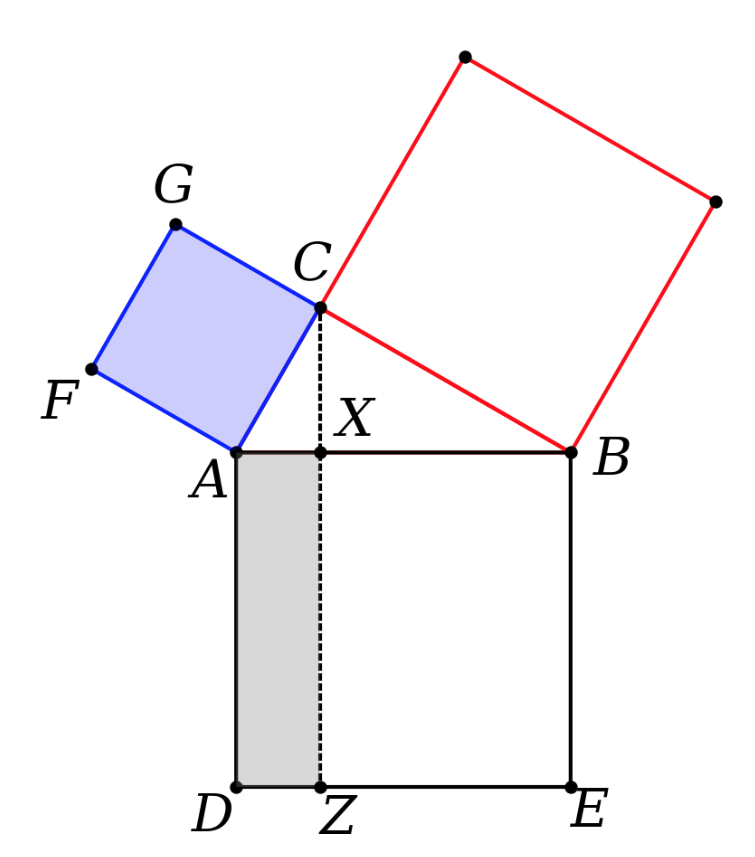
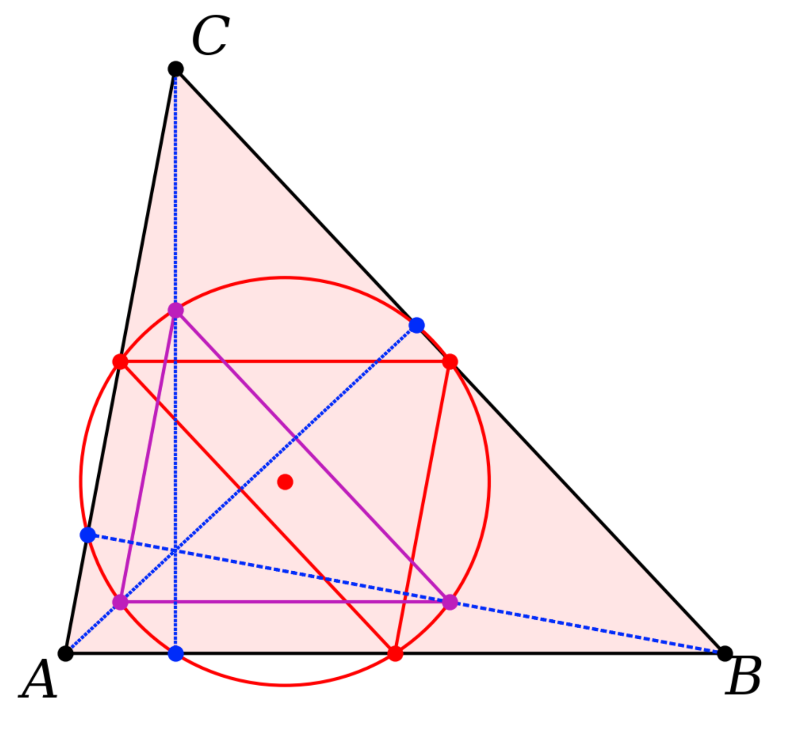
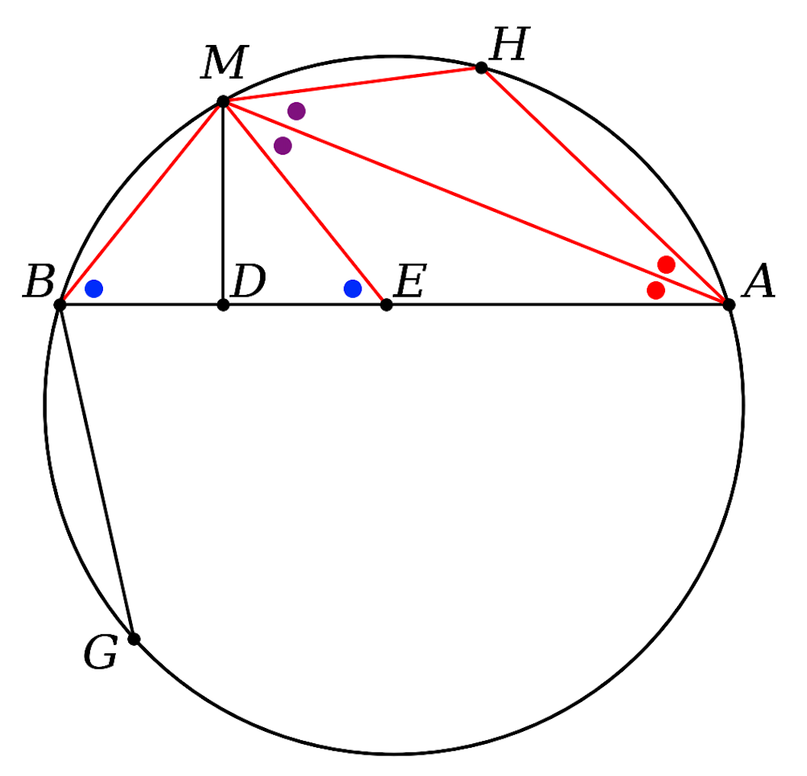
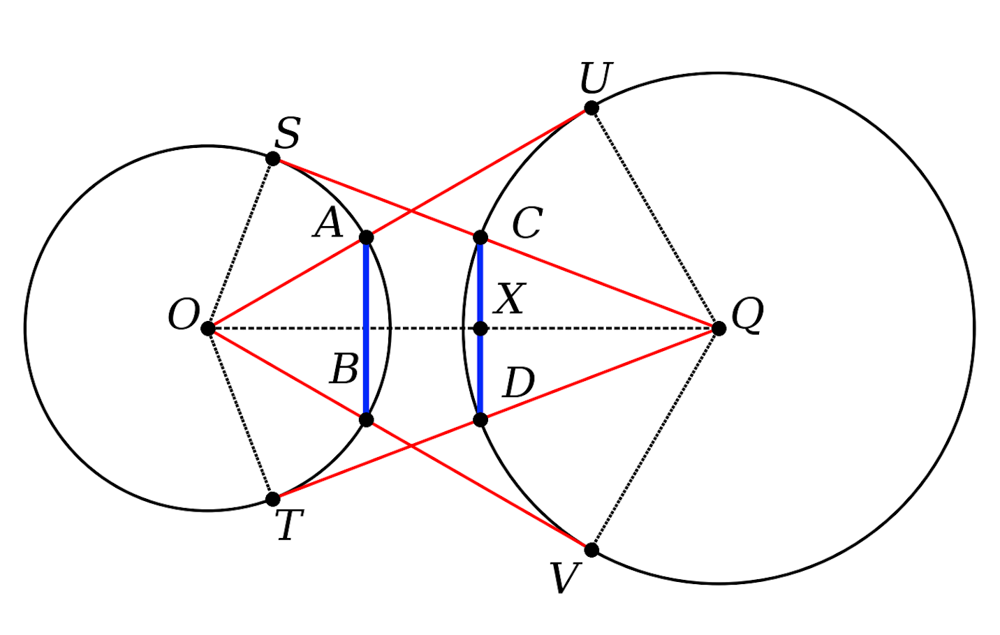
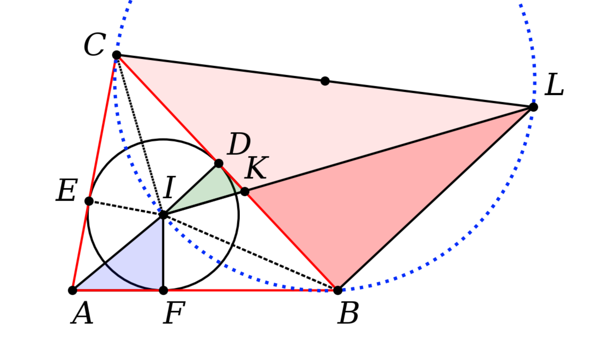
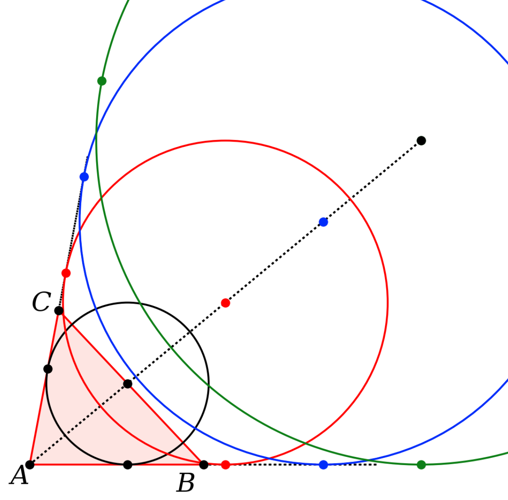
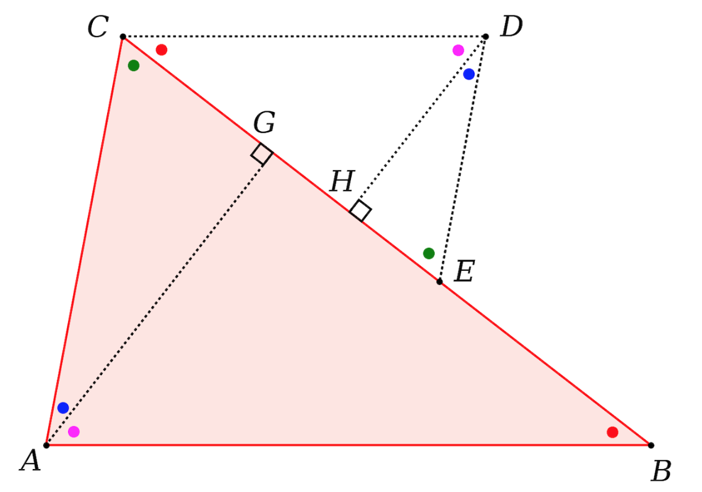

This project is a small Python library to use in drawing figures for my geometry textbook.

Here is a [list](list.txt) of the functions defined there.

Here are some figures made using the library:

**Euclid I.47**



**nine point circle**



**broken chord proof 1**



**eyeball theorem**



**Heron's theorem**



**excircle**



**similar triangles**



There are also a couple of write-ups, including one about Archimedes' broken chord theorem.

The only objects we define are members of the class **Point**, to allow access by P.x and P.y.

**pL** stands for *point list*, i.e. a list of Point objects.

We pretend to implement some of Euclid's constructions, but intersections between lines and circles are computed by analytic geometry.   Under the hood, it is algebra.  

When there are two such points, the order in which they are returned is (i) the point closest to the line segment first, if there is one, or (ii) the point closest to the origin.  In earlier code there was some fiddling to pick the right point.

At present, the output paths for figures are hard-coded so it will require a bit of configuration to get it to work on another machine.  That's on my todo list.  The library has a sym link in the sub-folders.

Here are some examples of the functions we can call:

```
geo.get_intersection_for_two_lines([A,B],[C,D])
geo.get_point_perp_on_line_for_point(P,[A,B])
geo.get_perp_at_point_by_fractional_length([A,B],f=0.5)

get_intersection_line_segment_circle([A,B],[Q,r])
get_intersection_circle_circle([Q1,r1],[Q2,r2])
get_tangent_points_on_circle_for_point([Q,r],P)
```

These are from the callee's POV.  In the library's function definition, you cannot have ``([A,B],[C,D])``, it is

```
geo.get_intersection_for_two_lines(pL1,pL2)
```

Errors can be hard to interpret with matplotlib.  In drawing functions like 

```
geo.outline_polygon(ax,[A,B,E,D],ec='k')
geo.draw_line_segments(ax,[[D,F],[C,F]])
```

If you forget ``ax`` in the first one, the error is:

```
TypeError: outline_polygon() missing 1 required 
positional argument: 'pL'
```

If you forget to make a list of line segments by adding a second pair of brackets in the second one:

```
TypeError: draw_line_segments() got multiple values 
for argument 'ec'
```

Other mistakes with brackets may result in Python trying to access a coordinate like ``P.x`` and complaining that a list doesn't have one.

```
AttributeError: 'tuple' object has no attribute 'x'
```