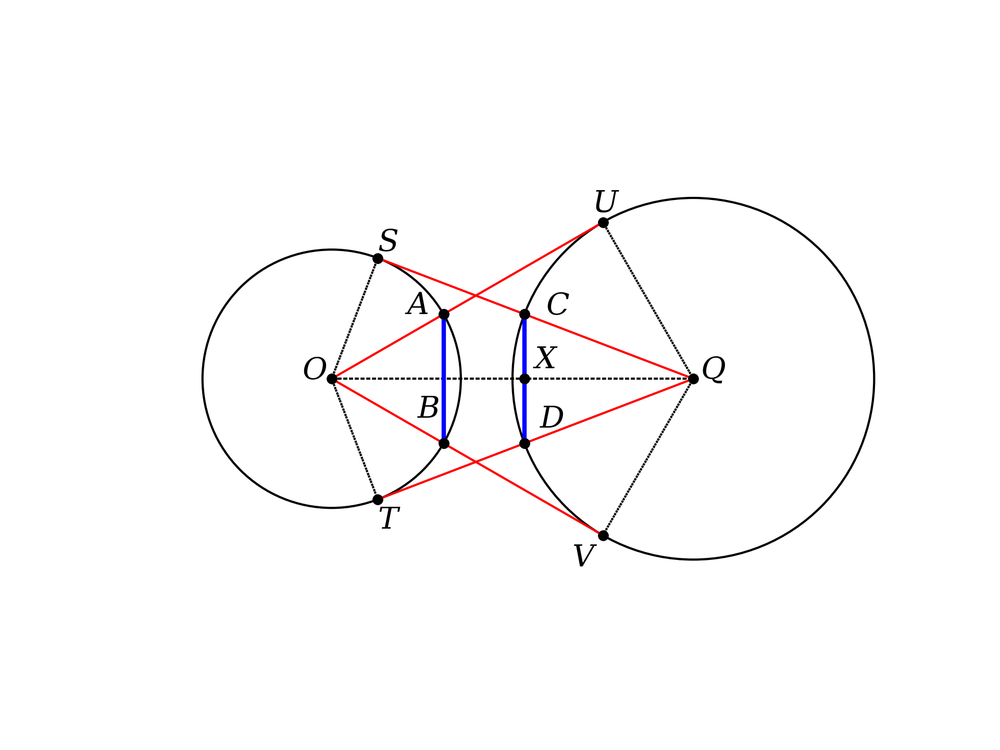
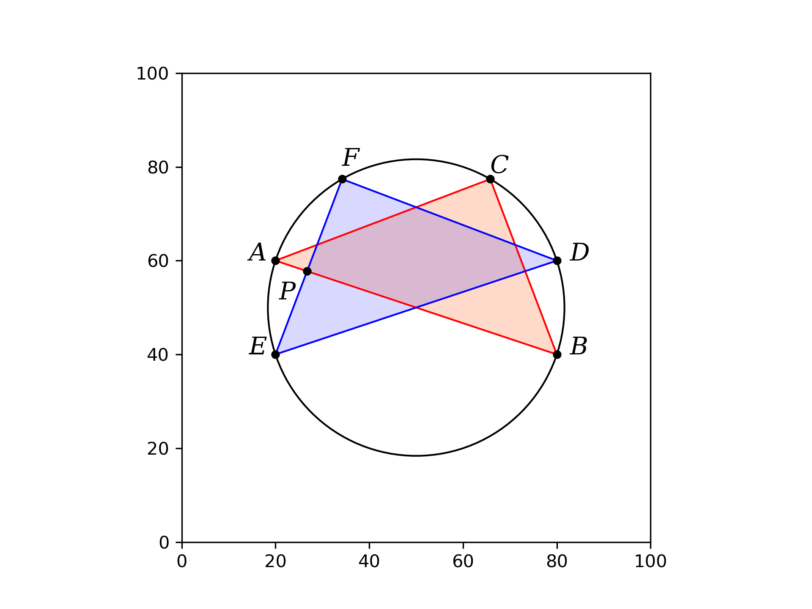
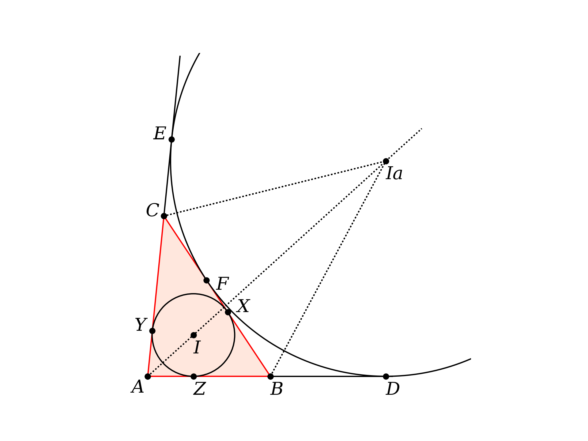

This project is a Python library to use in drawing figures for my geometry textbook.

Here are some figures made using the library:

**nine point circle**


**broken chord proof 1**


**eyeball theorem**



*star of david* **proof of Pythagoras**



**excircle**



There are also a couple of write-ups, including one about Archimedes' broken chord theorem.

The only objects we define are members of the class **Point**, to allow access by P.x and P.y.

**pL** stands for *point list*, i.e. a list of Point objects.

Intersections between lines and circles are computed by analytic geometry.  We pretend to implement some of Euclid's constructions, but under the hood it is algebra.  

When there are two such points, the order in which they are returned is (i) the point closest to the line segment first, or (ii) the point closest to the origin.  This can take some fiddling to pick the right point.

At present, the output paths for figures are hard-coded so it will require a slight bit of configuration to get it to work on another machine.  That's on my todo list.

Here are a few examples of the functions we can call:

```
geo.get_intersection_for_two_lines([A,B],[C,D])
geo.get_point_perp_on_line_for_point(P,[A,B])
geo.get_perp_at_point_by_fractional_length([A,B],f=0.5)

get_intersection_line_segment_circle([A,B],[Q,r])
get_intersection_circle_circle([Q1,r1],[Q2,r2])
get_tangent_points_on_circle_for_point([Q,r],P)
```

These are from the callee's POV.  In the library's function definition, you cannot have ``([A,B],[C,D])``, it is

```
geo.get_intersection_for_two_lines(pL1,pL2)
```

and so on.