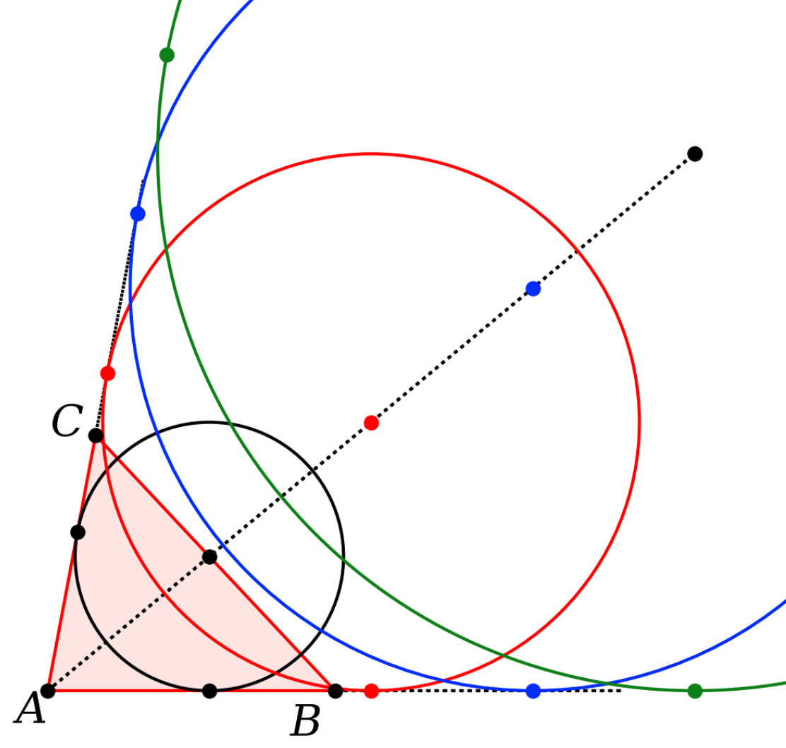

This project is a small Python library, ``geometry.py``, to use in drawing figures for my geometry textbook.  The library is contained in a single file at top level:  ``geometry.py``.  

I am running Python 3.13 obtained via Homebrew, so I put a symbolic link to geometry.py in:

```
 /usr/local/lib/python3.13/site-packages/geometry.py
```
 

The ``projects`` directory contains sub-directories with various scripts using it. Other scripts written during development to test particular issues are in ``tests``.

Here is a [list](list/list.txt) of all the functions defined there.

Some examples of figures made using the library:

**basic demo**

Starting with triangle ABC, construct the parallelograms on each side, by bisecting the side and then doubling the length (here AD = twice AK).


*Proof*  ABK and DCK are congruent by SAS.  It follows that CD is parallel to AB.  The same argument applies to BD and AC.  With both pairs of opposing sides parallel, ABDC is a parallelogram.

All four of the smaller triangles are congruent and similar to the large triangle DEF.  This is like the midline theorem in reverse.

**Euclid I.2**


**Euclid II.5**


*Proof*  Let C bisect AB and D be an arbitrary point on CB.  Draw the squares on DB and CB.  It follows that CDHL equals MFGH, so AD.BD is equal to the gnomon CBFGHL.  The latter is equal to the difference of squares BC^2 - CD^2.

**Euclid II.11**


Division of a line segment into the golden mean.  

*Proof*.  Draw the square on AB and then bisect AC at E.  Draw the circle on center E with radius BE and find where it cuts the extension of CA at F.  Draw the square on AF.  

The idea of the proof is then to show that AB/AH = AH/HB and 

AB.HB = AH^2

The LHS is the area of the red rectangle and the RHS is the area of the small blue square.  We show they are equal by subtracting the rectangle AHKC from two other equal areas:  the square on AB, and the rectangle CFGK.

To obtain the last result, start from Euclid II.6

CF.AF = EF^2 - AE^2

But EF = EB and EB^2 - AE^2 = AB^2 by Euclid I.47 so

CF.AF = AB^2

We have shown that the rectangle CFGK is equal in area to the square on AB.  Subtract AHKC from both and we obtain the needed equality.

**Euclid IV.10**


By construction, we have that AC = BD and

AB/AC = AC/BC

AC^2 = AB.BC = BD^2

By the converse of the tangent-secant theorem, it follows that BD is tangent to the dotted circle.  < BDC cuts the same arc as < CAD, so they are equal.  Since the triangles BAD and BDC have the same vertex angle and share the base angle at B, they are similar.  They are also isosceles, since AB and AD are radii of the first circle. 

Thus CD = BD = AC.  So triangle ACD is also isosceles.  From this and the external angle theorem, we can deduce that <B = <BCD is twice <A.  This is the basic construct for the pentagon.  The vertex of the isosceles triangles measures 1/5 of a right angle.

**ϕ**


Let the diameter of the circle be 1.  Then the length of the diagonal of the rectangle is sqrt(5).  Let x be the distance from one corner to the circle.

2x + 1 = √5

x = (√5 - 1)/2 = phi - 1

But

phi^2 = 1 + phi

1/phi = phi - 1

**Pizza theorem**

[wikipedia](https://en.wikipedia.org/wiki/Pizza_theorem)


**Euclid I.47**


**Pappus**


On two sides of triangle ABC draw arbitrary parallelograms.  Extend the two new sides to meet at H.

Draw RAJ parallel to HCTU with RA = AJ, and do likewise for SBI.

From the properties of parallelograms, is easy to show that

(ACDE) = (ACHR) = (AJUT).

Thus the area of the parallelogram on side AB is the sum of the areas of the other two.

The Pythagorean theorem is a special case for a right triangle and squares on the sides.

**triangle rotation**


**nine point circle**


The nine point circle goes through the midpoints of the sides, which are the vertices of the medial triangle.  It also goes through the feet of the altitudes and, when the medial triangle is rotated 180 degrees, the vertices are concurrent with the other three points, which bisect that part of each altitude between the orthocenter and the vertices of the original triangle.

**broken chord proof 1**


This problem, famously studied by Archimedes, has as given:  arc AM = GM, with B lying in the minor arc GM.  MD is drawn perpendicular to AB.  We claim that GB + BD = AD.

**eyeball theorem**


Show that AB = CD.

**Heron's theorem**


**excircle**



**similar triangles**


A proof that extends the similarity of right triangles to similarity for all triangles.

**Phi in the hexagon**


Show that AP/AB = phi.  MF is half the radius of the circle on Q.  The rest is algebra and an application of the Pythagorean theorem.

<h4>Notes</h4>

There are also a couple of write-ups, including one about Archimedes' broken chord theorem and another about excircles.

This is functional programming.  The only objects we define are members of the class **Point**, to allow access via P.x and P.y.

The variable name **pL** found in most function definitions stands for *point list*, i.e. a list of Point objects.  This may be a line segment, a triangle or another polygon.

We pretend to implement some of Euclid's constructions, but intersections between lines and circles are computed by analytic geometry.   Under the hood, it is algebra.  

When there are two points in a result to be returned, the order in which they are returned is sometimes challenging to determine.  In the latest version, for two points, say, perpendicular to a line segment, we return the point "above" the line segment first, if you visualize the line segment as oriented left-to-right.  

Some examples may differ.  For circle-circle intersection, we return the point closer to the origin first.

For a perpendicular or angle bisector, the *length* of the perpendicular or bisector is arbitrary.  It should be adjusted by the caller, using the following trick:

```
S,T = geo.get_perp_at_point_by_fractional_length([A,B],f=0.5)
X = geo.get_intersection_for_two_lines([A,B],[S,T])

d = 10   # or whatever the desired length is
f = d/geo.get_length([X,S])
geo.get_point_by_fractional_length([X,S],f)


```

As I fiddled with the code, inconsistency in the order of return of two points has messed up many a diagram.  I believe that's all fixed now.

For most examples, output paths for figures are hard-coded so it will require a bit of configuration to get it to work on another machine.  I have tried to automate that for newer code, but haven't fixed the old examples.  

Here are a few of the functions we can call:

```
geo.get_intersection_for_two_lines([A,B],[C,D])
geo.get_point_perp_on_line_for_point(P,[A,B])
geo.get_perp_at_point_by_fractional_length([A,B],f=0.5)

get_intersection_line_segment_circle([A,B],[Q,r])
get_intersection_circle_circle([Q1,r1],[Q2,r2])
get_tangent_points_on_circle_for_point([Q,r],P)
```

These are from the caller's POV.  In the library's function definition, you cannot have ``([A,B],[C,D])``, it is

```
geo.get_intersection_for_two_lines(pL1,pL2)
```

``matplotlib`` gives error messages that can be challenging to interpret.  If you forget an argument in a function call, it simply reports the *last* one missing.  So, in drawing functions like 

```
geo.outline_polygon(ax,[A,B,E,D],ec='k')
geo.draw_line_segments(ax,[[D,F],[C,F]])
```

If you forget ``ax`` in the first one, the error is:

```
TypeError: outline_polygon() missing 1 required 
positional argument: 'pL'
```

If you forget to make a list of line segments by adding a second pair of brackets in the second one:

```
TypeError: draw_line_segments() got multiple values 
for argument 'ec'
```

Other mistakes with brackets may result in Python trying to access a coordinate like ``P.x`` and complaining that a list doesn't have one.

```
AttributeError: 'tuple' object has no attribute 'x'
```

Finally, the functions in the library have long, but I hope explicit, names.  I'm experimenting with shortcut definitions ([here](list/short.txt)).

The shortcuts live in the library (at the end). 

For this we might do ``from geometry import *`` in spite of the fact that it's generally not good practice.  Or, one might call them like

```
geo.gtr()
```