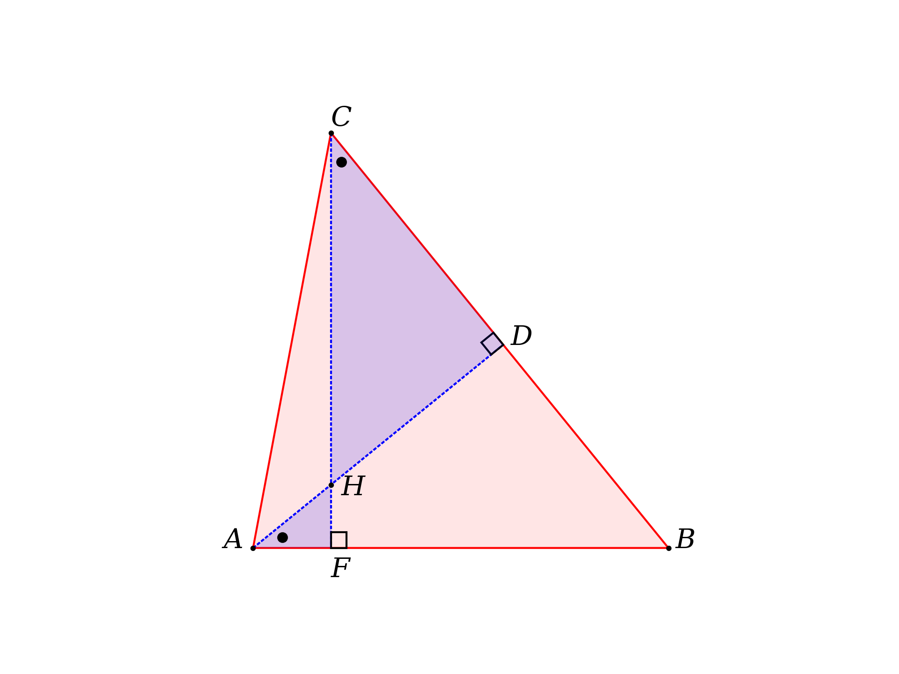

This project is a small Python library to use in drawing figures for my geometry textbook.  The library is at top level in ``geometry.py``.  

The various directories are simply examples using it.  

Here is a [list](list_functions/list.txt) of the functions defined there.

Some example figures made using the library:

**basic demo**



**Pizza theorem**


**Euclid I.47**


**triangle rotation**


**nine point circle**


**broken chord proof 1**


**eyeball theorem**


**Heron's theorem**


**excircle**


**similar triangles**


There are also a couple of write-ups, including one about Archimedes' broken chord theorem and another about excircles.

This is functional programming.  The only objects we define are members of the class **Point**, to allow access by P.x and P.y.

The variable name **pL** found in most function definitions stands for *point list*, i.e. a list of Point objects.  This may be a line segment, a triangle or another polygon.

We pretend to implement some of Euclid's constructions, but intersections between lines and circles are computed by analytic geometry.   Under the hood, it is algebra.  

When there are two points in a result to be returned, the order in which they are returned is challenging to determine.  In the latest version, for two points, say, perpendicular to a line segment, we return the point "above" the line segment first, if you visualize the line segment as oriented left-to-right.  Some examples may differ.

For circle-circle intersection, we return the point closer to the origin first.

For a perpendicular or angle bisector, the *length* of the perpendicular or bisector should be adjusted by the callee, using the following trick:

```
S,T = get_perp_at_point_by_fractional_length([A,B],f=0.5)
X = get_intersection_for_two_lines([A,B],[S,T])
d = 10   # or whatever the desired length is
f = d/get_length([X,S])
get_point_by_fractional_length([X,S],f)


```

As I fiddled with the code, inconsistency in the order of return of two points has messed up many a diagram.  I believe that's all fixed now.

For most examples, output paths for figures are hard-coded so it will require a bit of configuration to get it to work on another machine.  That's on my todo list.  

There is a sym link to the library in each sub-folder.

Here are some functions we can call:

```
geo.get_intersection_for_two_lines([A,B],[C,D])
geo.get_point_perp_on_line_for_point(P,[A,B])
geo.get_perp_at_point_by_fractional_length([A,B],f=0.5)

get_intersection_line_segment_circle([A,B],[Q,r])
get_intersection_circle_circle([Q1,r1],[Q2,r2])
get_tangent_points_on_circle_for_point([Q,r],P)
```

These are from the callee's POV.  In the library's function definition, you cannot have ``([A,B],[C,D])``, it is

```
geo.get_intersection_for_two_lines(pL1,pL2)
```

Errors can be challenging to interpret with matplotlib.  In drawing functions like 

```
geo.outline_polygon(ax,[A,B,E,D],ec='k')
geo.draw_line_segments(ax,[[D,F],[C,F]])
```

If you forget ``ax`` in the first one, the error is:

```
TypeError: outline_polygon() missing 1 required 
positional argument: 'pL'
```

If you forget to make a list of line segments by adding a second pair of brackets in the second one:

```
TypeError: draw_line_segments() got multiple values 
for argument 'ec'
```

Other mistakes with brackets may result in Python trying to access a coordinate like ``P.x`` and complaining that a list doesn't have one.

```
AttributeError: 'tuple' object has no attribute 'x'
```

Finally, the functions in the library have long, but I hope explicit, names.  I'm experimenting with shortcut definitions:

```
tr =  get_standard_triangle
sc =  scatter_points
ls =  draw_line_segments
fp =  fill_polygon
op =  outline_polygon
pf =  get_point_by_fractional_length
cc =  get_circumcircle
oa =  get_orthocenter_and_altitudes
cm =  get_centroid_and_medians
ib =  get_incenter_and_bisectors
xll = get_intersection_for_two_lines
xlc = geo.get_intersection_line_segment_circle(pL,cL)
xcc = geo.get_intersection_circle_circle(cL1,cL2)
ba =  bisect_angle_Euclid(A,pL)
rp =  rotate_points_around_center_by_angle(pL,Q,theta)
tp =  translate_points(pL,dx=0,dy=0)
st =  scale_triangle(pL,f=1.0)
ma =  mark_angle(pL,d=5)
mra = mark_right_angle(A,pL,n=3)
rl  = get_rectangle_for_line
```

For this we do ``from geometry import *`` in spite of the fact that it's generally bad practice.  That's so the shortcuts can live in the library.  Alternatively, one might place them in each script, prefaced like

```
tr =  geo.get_standard_triangle
```